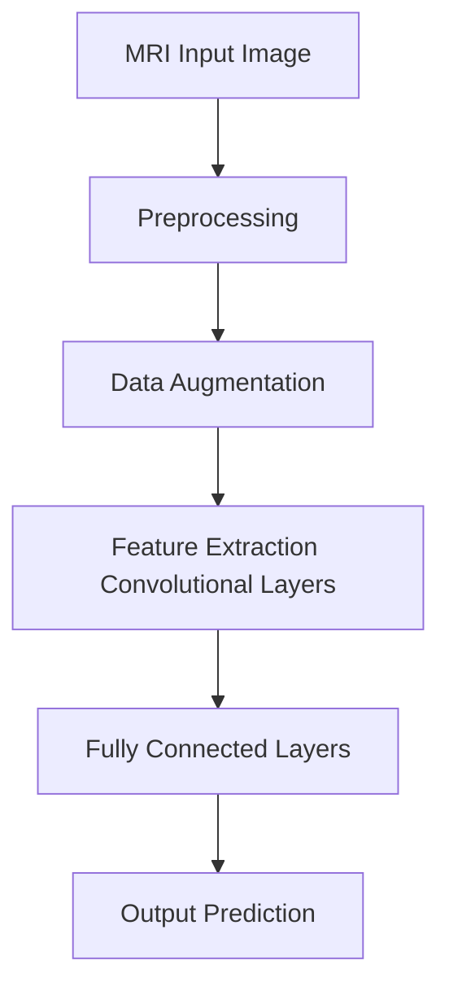

# Brain Tumor Detection


## Description
This project performs binary classification of brain MRI scans for tumor detection (Tumor vs. No Tumor). The goal is to provide a comprehensive, production-ready machine learning pipeline, including model training, evaluation, predictions, and a scalable API.

## Architecture



## Features
- Modular code structure (preprocessing, data loading, models, training, evaluation, API)
- Supports training Custom CNN or pre-trained MobileNetV2 models
- Grad-CAM integration for interpretability of predictions
- Robust configuration via YAML
- Production-ready FastAPI endpoints for prediction and batch predictions
- Utility scripts to export models (SavedModel, TFLite)

## Installation

1. Clone the repository
```bash
git clone https://github.com/your-username/brain-tumor-detection.git
cd brain-tumor-detection
```

2. Create a virtual environment and activate it
```bash
python -m venv venv
# On Windows
venv\Scripts\activate
# On Unix or MacOS
source venv/bin/activate
```

3. Install dependencies
```bash
pip install -r requirements.txt
```

## Quick Start

### Training
```bash
python -m brain_tumor_detection train --config config/default.yaml
```

### Prediction
```bash
python -m brain_tumor_detection predict --image path/to/mri.jpg --model outputs/checkpoints/best_model.keras
```

### API Server
```bash
python -m brain_tumor_detection serve --model outputs/checkpoints/best_model.keras
```

## Configuration

We use YAML configuration files to customize training and architecture settings. View `config/default.yaml` for options related to batch size, learning rate, and epochs.

## API Documentation

- `GET /health` : Health check.
- `GET /model/info` : Get loaded model details.
- `POST /predict` : Predict for a single image.
- `POST /predict/batch` : Predict for multiple images.
- `POST /predict/explain` : Get a Grad-CAM explanation heatmap.

## Project Structure
```
brain-tumor-detection/
├── config/
│   └── default.yaml
├── data/
│   └── raw/
│       ├── yes/
│       └── no/
├── outputs/
├── scripts/
│   └── export_model.py
├── src/
│   └── brain_tumor_detection/
├── tests/
├── README.md
└── requirements.txt
```

## Dataset
The dataset consists of Brain MRI images for Tumor Detection (e.g. from Kaggle), separated into `yes` and `no` folders. Images undergo preprocessing to crop brain contours and resize to 224x224.

## Model Architectures
- **Custom CNN**: A robust custom convolutional network built for generic object/feature detection tasks.
- **MobileNetV2**: A lightweight CNN architecture pre-trained on ImageNet, perfect for fine-tuning.

## Testing
Run the test suite using pytest:
```bash
pytest tests/
```

## License
Apache 2.0 License.

## Acknowledgments
- Thanks to the community for open-sourcing the datasets used in this project.
